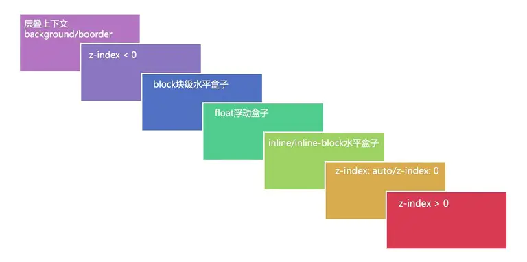

#### 层叠上下文

英文称作 `stacking context`，HTML 元素沿着其相对于用户的一条虚构的 z 轴排开，层叠上下文就是对这些 HTML 元素的一个三维构想。

- z-index属性值并不是在任何元素上都有效果。它仅在定位元素（定义了position属性，且属性值为非static值的元素）上有效果。
- 判断元素在Z轴上的堆叠顺序，不仅仅是直接比较两个元素的z-index值的大小，这个堆叠顺序实际由元素的层叠上下文、层叠等级共同决定。
- 层叠上下文可以包含在其他层叠上下文中，并且一起创建一个层叠上下文的层级。
- 每个层叠上下文都完全独立于它的兄弟元素：当处理层叠时只考虑子元素。
- 每个层叠上下文都是自包含的：当一个元素的内容发生层叠后，该元素将被作为整体在父级层叠上下文中按顺序进行层叠。

#### 层叠水平/层叠等级

英文称作 `stacking level`，决定了同一个层叠上下文中元素在z轴上的显示顺序。

- 普通元素的层叠水平优先由层叠上下文决定
- 层叠水平的比较只有在当前层叠上下文元素中才有意义。

#### 如何产生
- HTML中的根元素 `<html></html>` 本身就具有层叠上下文，称为“根层叠上下文”。
- 普通元素设置 position 属性为非 static 值并设置 z-index 属性为具体数值，产生层叠上下文。
- CSS3 中的新属性也可以产生层叠上下文。

#### 层叠顺序
表示元素发生层叠时按照特定的顺序规则在 Z 轴上垂直显示

#### 层叠准则
**谁大谁上**：当具有明显的层叠水平标示的时候，如识别的z-index值，在同一个层叠上下文领域，层叠水平值大的那一个覆盖小的那一个
**后来居上**：当元素的层叠水平一致、层叠顺序相同的时候，在DOM流中处于后面的元素会覆盖前面的元素。

#### CSS3中的属性对层叠上下文的影响
- 父元素的 display 属性值为 flex|inline-flex，子元素 z-index 属性值不为 auto 的时候，子元素为层叠上下文元素；
- 元素的 opacity 属性值不是1；
- 元素的 transform 属性值不是 none；
- 元素 mix-blend-mode 属性值不是 normal`；
- 元素的 filter 属性值不是 none；
- 元素的 isolation 属性值是 isolate；
- will-change 指定的属性值为上面任意一个；
- 元素的 -webkit-overflow-scrolling 属性值设置为 touch。
